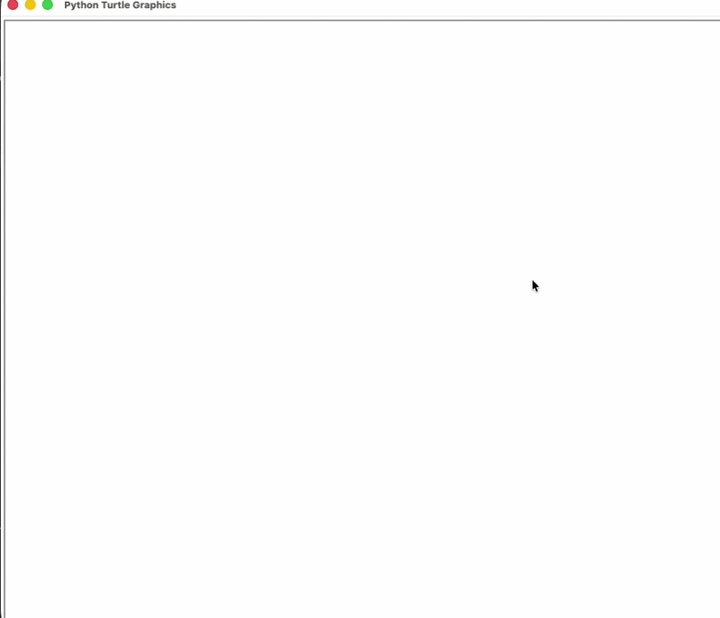

# 🎨 Damien Hirst "Dot" in Python

A creative Python script that reconstructs popular painting "Dot" by Damien Hirst. Program uses image processing to extract colors from photo and recreates painting using the Turtle library

## 🛠 Tech Stack
* Python
* Turtle
* Colorgram.py

## ✨ Key Features
- **Color Extraction:** Automatically extract colors from any provided image.
- **Generative Art:** Recreates artwork using a randomized color palette.
- **Automated Drawing:** High-speed, programmed rendering process.

## 🧭 The Process
My goal was to try combine algorithmic thinking with some graphic design. I wanted to see if I could automate the process of paiting.

I started by using `colorgram` to analyze the source image and generate a list of RGB values. After that, I implemented a library (`turtle`) that will help me with automatic painting. It’s a perfect example of how code can act as a digital brush.

## 🚀 Running the Project
1. Clone this repository.
2. Make sure you have the required libraries installed:
   `pip install colorgram.py`
3. Place a `photo.jpg` in the project folder.
4. Run the script:
   `python main.py`
## 🎞️ Preview

